# Single-Shot Motion Completion with Transformer

:point_right:[[Preprint](https://arxiv.org/abs/2103.00776)]:point_left:	

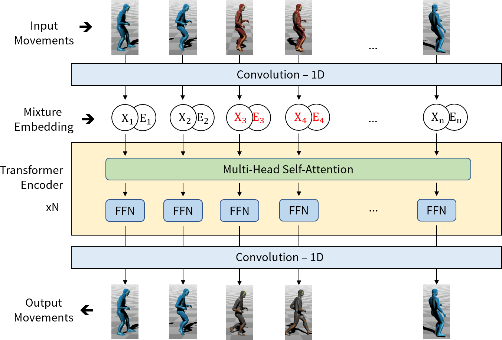

## <u>Abstract</u>

Motion completion is a challenging and long-discussed problem, which is of great significance in film and game applications. For different motion completion scenarios (in-betweening, in-filling, and blending), most previous methods deal with the completion problems with case-by-case designs. In this work, we propose a simple but effective method to solve multiple motion completion problems under a unified framework and achieves a new state of the art accuracy under multiple evaluation settings. Inspired by the recent great success of attention-based models, we consider the completion as a sequence to sequence prediction problem. Our method consists of two modules - a standard transformer encoder with self-attention that learns long-range dependencies of input motions, and a trainable mixture embedding module that models temporal information and discriminates key-frames. Our method can run in a non-autoregressive manner and predict multiple missing frames within a single forward propagation in real time. We finally show the effectiveness of our method in music-dance applications.

## <u>State-of-the-art on Lafan1 dataset</u>

With the help of Transformer, we achieve a new SOTA result on [Lafan1 dataset](https://github.com/ubisoft/ubisoft-laforge-animation-dataset).

|Lengths = 30| L2Q | L2P | NPSS |
|:-----|:------:|:------:|:------:|
|Zero-Vel| 1.51 | 6.60 | 0.2318 |
|Interp.| 0.98 | 2.32 | 0.2013 |
|[ERD-QV](https://montreal.ubisoft.com/en/automatic-in-betweening-for-faster-animation-authoring/)| 0.69 | 1.28 | 0.1328 |
|Ours|**0.61**| **1.10**| **0.1222** |

* Some results (blue appearaces represent keyframes):

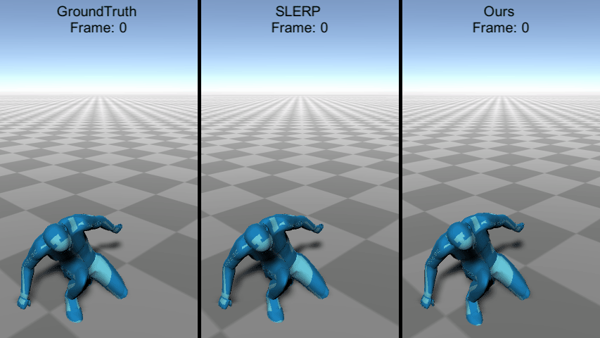 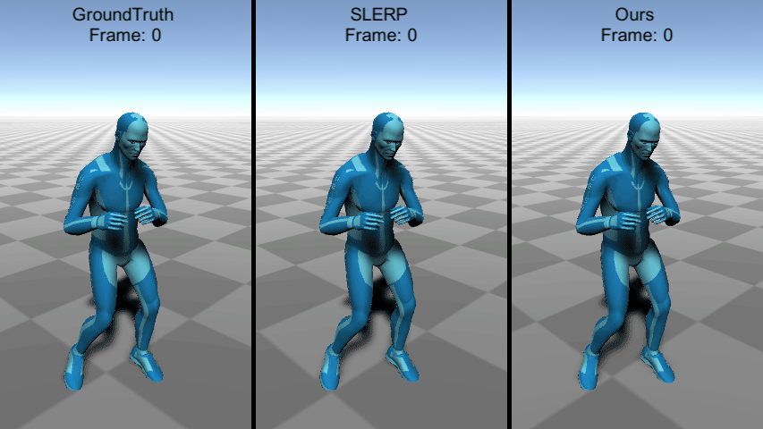

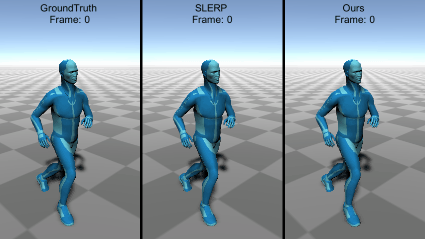 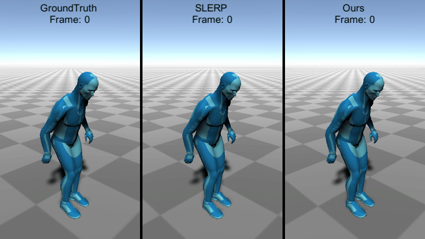

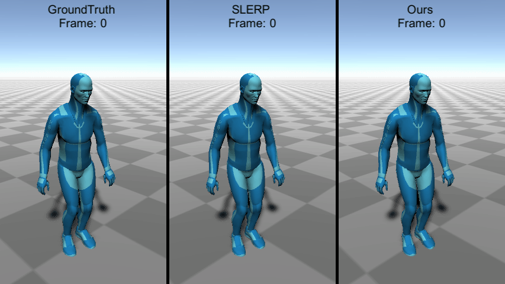 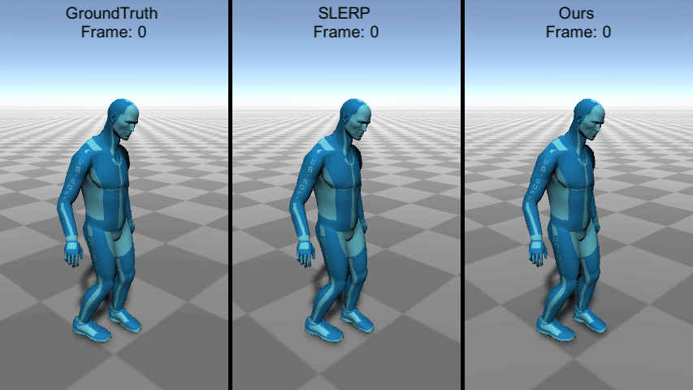

## <u>Dance Infilling on Anidance Dataset</u>

We also evaluate our method on the [Anidance dataset](https://github.com/Music-to-dance-motion-synthesis/dataset):

* Infilling on the test set (black skeletons are the keyframes):

(From Left to Right: `Ours`, `Interp`. and `Ground Truth`)

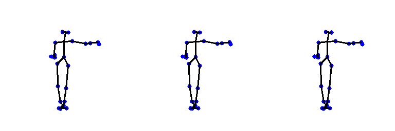

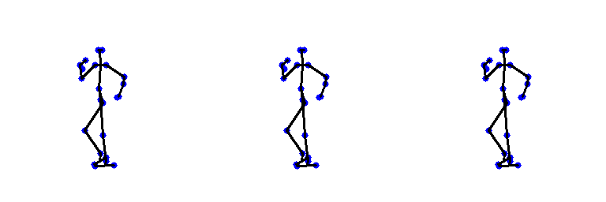

* Infilling on random keyframes (keyframes are randomly chosen from the test set with a random order for simulating in-the-wild scenario):

(From Left to Right: `Ours`, `Interp`. and `Ground Truth`)

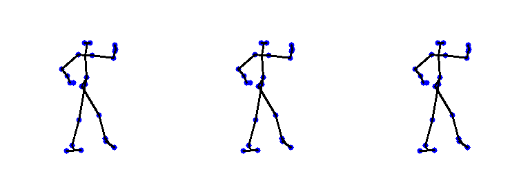

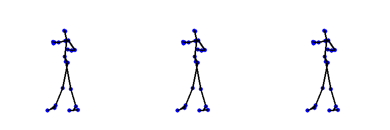

## <u>Dance blending</u>

Our method can also work on complex dance movement completion:

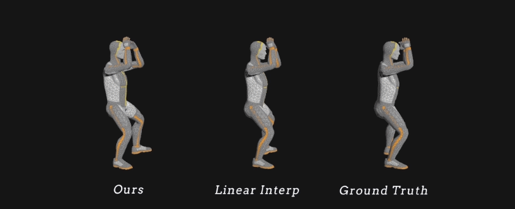

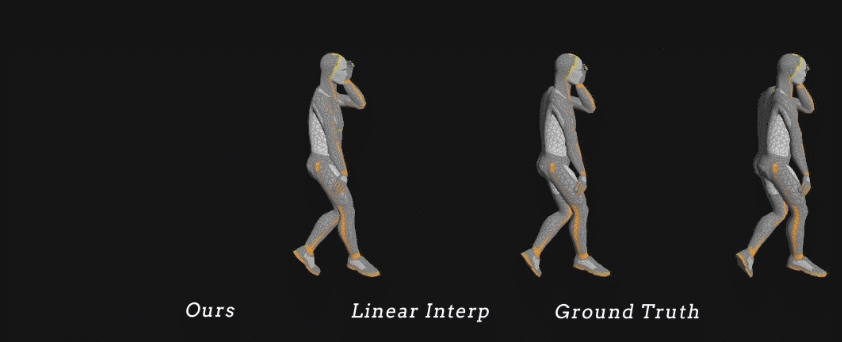

## <u>Code</u>

*Coming soon*

## <u>Citation</u>
```
@misc{duan2021singleshot,
      title={Single-Shot Motion Completion with Transformer}, 
      author={Yinglin Duan and Tianyang Shi and Zhengxia Zou and Yenan Lin and Zhehui Qian and Bohan Zhang and Yi Yuan},
      year={2021},
      eprint={2103.00776},
      archivePrefix={arXiv},
      primaryClass={cs.CV}
}
```
